##### 1- sequence_user_registration 

```mermaid
    sequenceDiagram
    autonumber
    participant Client as 📱 UI / Client
    participant API as 🌐 Presentation (API)
    participant BL as 🧠 Business Logic (Facade)
    participant DB as 💾 Persistence (DB)

    Client->>API: POST /users {first_name, last_name, email, password}
    API->>BL: register_user(first_name, last_name, email, password)
    BL->>DB: check_email_exists(email)
    DB-->>BL: Email unique
    BL->>DB: create_user(id, first_name, last_name, email, password, is_admin=false)
    DB-->>BL: User saved (createdAt)
    BL-->>API: User details
    API-->>Client: 201 Created
    end
```


##### 2- sequence_place_creation 

```mermaid
sequenceDiagram
    autonumber
    participant Owner as 👤 Property Owner
    participant API as 🌐 Presentation (API)
    participant BL as 🧠 Business Logic (Facade)
    participant DB as 💾 Persistence (DB)

    Owner->>API: POST /places {title, description, price, latitude, longitude, owner_id}
    API->>BL: create_place(title, description, price, latitude, longitude, owner_id)
    BL->>DB: validate_owner_exists(owner_id)
    DB-->>BL: Owner valid
    BL->>DB: save_place(id, title, description, price, latitude, longitude, owner_id)
    DB-->>BL: Place saved (createdAt, updatedAt)
    BL-->>API: Place details
    API-->>Owner: 201 Created

```




##### 3- sequence_review_submission

```mermaid
sequenceDiagram
    autonumber
    participant User as 👤 Visitor
    participant API as 🌐 Presentation (API)
    participant BL as 🧠 Business Logic (Facade)
    participant DB as 💾 Persistence (DB)

    User->>API: POST /reviews {place_id, user_id, rating, comment}
    API->>BL: submit_review(place_id, user_id, rating, comment)
    BL->>DB: check_place_and_user(place_id, user_id)
    DB-->>BL: Valid
    BL->>DB: create_review(id, place_id, user_id, rating, comment)
    DB-->>BL: Review saved (createdAt)
    BL-->>API: Review details
    API-->>User: 201 Created

```



##### 4- sequence_fetch_places

```mermaid
sequenceDiagram
    autonumber
    participant Client as 📱 UI / Client
    participant API as 🌐 Presentation (API)
    participant BL as 🧠 Business Logic (Facade)
    participant DB as 💾 Persistence (DB)

    Client->>API: GET /places
    API->>BL: get_all_places()
    BL->>DB: fetch_all_records("Places")
    DB-->>BL: List of places
    BL-->>API: JSON Array of Places
    API-->>Client: 200 OK

```


