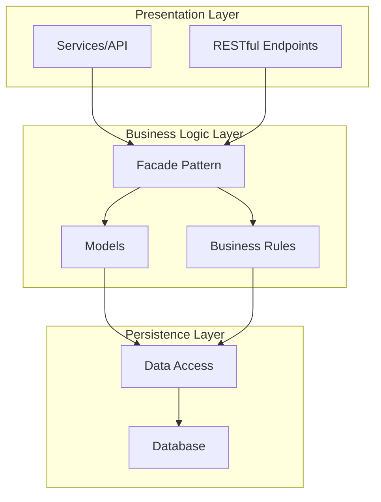
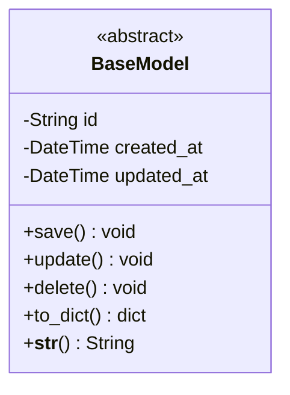
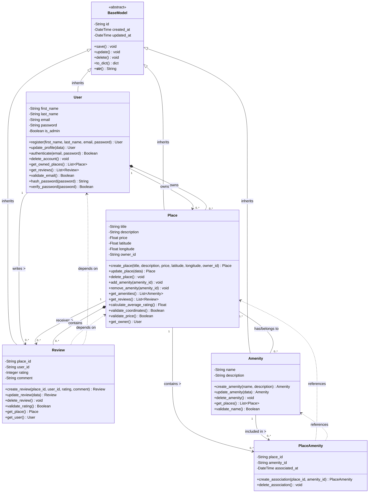
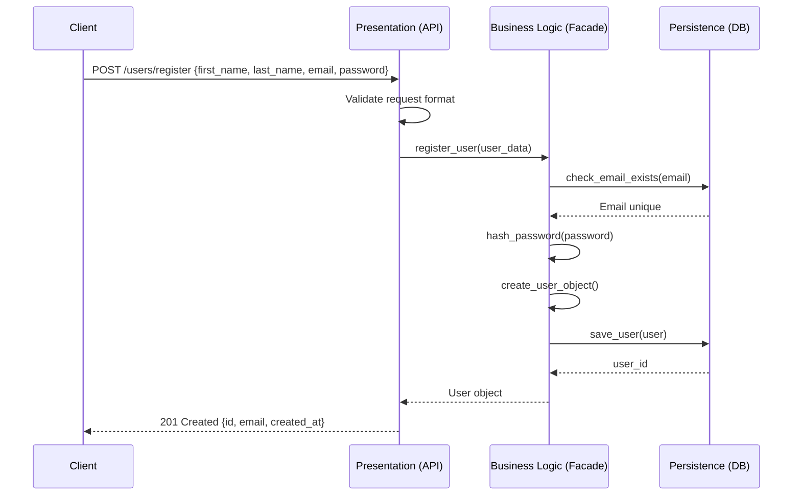
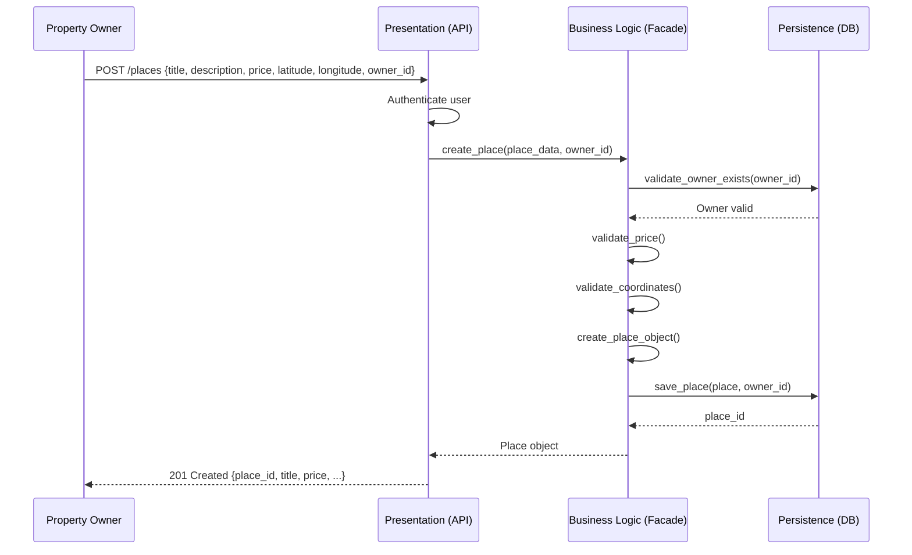
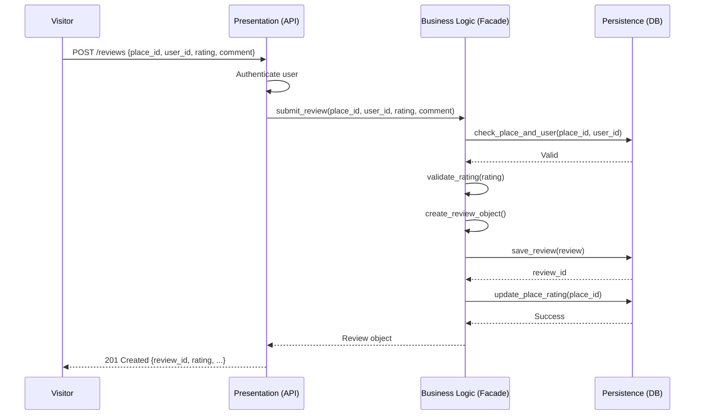
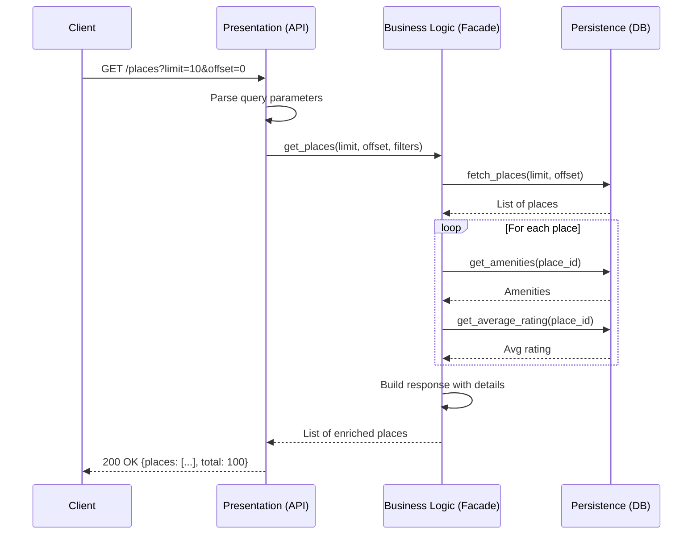

# HBnB Evolution - Technical Documentation
## Part 1: Architecture and Design Specification

---

**Project:** HBnB Evolution  
**Version:** 1.0  
**Date:** February 2026  
**Status:** Design Phase Complete

---

## Document Information

| Item | Description |
|------|-------------|
| **Document Purpose** | Comprehensive technical blueprint for HBnB Evolution application |
| **Audience** | Development team, stakeholders, and project evaluators |
| **Scope** | Architecture design, business logic specification, and API interactions |
| **Related Documents** | Implementation guides (Part 2), Database schema (Part 3) |

---

## Table of Contents

1. [Introduction](#1-introduction)
2. [Project Overview](#2-project-overview)
3. [High-Level Architecture](#3-high-level-architecture)
4. [Business Logic Layer](#4-business-logic-layer)
5. [API Interaction Flow](#5-api-interaction-flow)
6. [Design Decisions and Rationale](#6-design-decisions-and-rationale)
7. [Implementation Guidelines](#7-implementation-guidelines)
8. [Conclusion](#8-conclusion)
9. [Appendices](#9-appendices)

---

## 1. Introduction

### 1.1 Purpose of This Document

This technical documentation serves as the foundational blueprint for the **HBnB Evolution** application, a simplified AirBnB-like platform. It provides comprehensive architectural designs, detailed business logic specifications, and interaction flow diagrams that will guide the development team through the implementation phases.

The document ensures that all stakeholders have a clear, unified understanding of the system's structure, components, and behaviors before code development begins. This approach minimizes miscommunication, reduces development risks, and establishes quality standards for the project.

### 1.2 Document Scope

This documentation covers:

- **Architectural Design**: Three-layer architecture with facade pattern implementation
- **Business Logic Specification**: Detailed entity models with attributes, methods, and relationships
- **API Interaction Flows**: Sequence diagrams for critical user operations
- **Design Rationale**: Explanations of key architectural and design decisions
- **Implementation Guidelines**: Best practices and recommendations for development

This document does **not** cover:
- Specific database implementation (covered in Part 3)
- UI/UX design specifications
- Deployment and infrastructure details
- Testing strategies (to be defined in implementation phase)

### 1.3 How to Use This Document

**For Developers:**
- Use Section 3 to understand the overall system architecture
- Reference Section 4 for detailed business logic implementation
- Consult Section 5 when implementing API endpoints
- Follow guidelines in Section 7 during development

**For Project Managers:**
- Review Section 2 for project objectives and features
- Use Section 6 to understand design decisions and trade-offs
- Reference Section 8 for next steps and milestones

**For Evaluators:**
- All deliverables from Tasks 0-3 are compiled in this document
- Each section corresponds to specific project requirements
- Design decisions are justified with technical rationale

---

## 2. Project Overview

### 2.1 HBnB Evolution Application

**HBnB Evolution** is a property rental platform that connects property owners with potential guests. The application enables users to list properties, search for accommodations, leave reviews, and manage bookings.

### 2.2 Core Features

#### 2.2.1 User Management
- **User Registration**: New users can create accounts with personal information
- **Authentication**: Secure login with email and password
- **Profile Management**: Users can update their information
- **Role-Based Access**: Differentiation between regular users and administrators

#### 2.2.2 Place Management
- **Property Listings**: Owners can create detailed property listings
- **Property Details**: Title, description, pricing, and location information
- **Amenity Association**: Properties can be linked with multiple amenities
- **CRUD Operations**: Full create, read, update, and delete capabilities

#### 2.2.3 Review Management
- **Guest Reviews**: Users can review properties they've visited
- **Rating System**: Numerical ratings (1-5) with textual comments
- **Review Moderation**: Reviews can be updated or deleted
- **Aggregate Ratings**: Automatic calculation of average property ratings

#### 2.2.4 Amenity Management
- **Amenity Catalog**: Centralized management of property features
- **Flexible Association**: Amenities can be linked to multiple properties
- **Standard Amenities**: WiFi, parking, pool, air conditioning, etc.

### 2.3 Business Requirements

#### 2.3.1 User Entity Requirements
- **Attributes**: First name, last name, email (unique), password (hashed), admin status
- **Operations**: Register, authenticate, update profile, delete account
- **Validation**: Email format validation, password strength requirements
- **Security**: Passwords must be hashed before storage

#### 2.3.2 Place Entity Requirements
- **Attributes**: Title, description, price, latitude, longitude, owner reference
- **Operations**: Create listing, update details, delete listing, search properties
- **Validation**: Positive pricing, valid geographical coordinates
- **Relationships**: One-to-many with reviews, many-to-many with amenities

#### 2.3.3 Review Entity Requirements
- **Attributes**: Place reference, user reference, rating (1-5), comment
- **Operations**: Submit review, update review, delete review, list by place
- **Validation**: Rating within 1-5 range, required place and user associations
- **Business Rules**: Users can only review places they've visited

#### 2.3.4 Amenity Entity Requirements
- **Attributes**: Name (unique), description
- **Operations**: Create amenity, update details, delete amenity, list all
- **Validation**: Unique names across all amenities
- **Relationships**: Many-to-many with places

### 2.4 System-Wide Requirements

#### 2.4.1 Unique Identification
All entities must have universally unique identifiers (UUID4) to ensure:
- Global uniqueness across distributed systems
- No collision risks during data migration
- Simplified referencing and data integrity

#### 2.4.2 Audit Trail
For compliance and debugging purposes, all entities must track:
- **created_at**: Timestamp of entity creation
- **updated_at**: Timestamp of last modification

This enables:
- Historical data analysis
- Troubleshooting and debugging
- Compliance with data regulations
- Understanding system usage patterns

---

## 3. High-Level Architecture

### 3.1 Architectural Overview

HBnB Evolution follows a **three-layer architecture** pattern, which provides clear separation of concerns and promotes maintainability, testability, and scalability.



### 3.2 Layer Responsibilities

#### 3.2.1 Presentation Layer

**Purpose**: Interface between external clients and the application

**Responsibilities**:
- Handle HTTP requests and responses
- Input validation and sanitization
- Authentication and authorization
- Request routing to appropriate business logic
- Response formatting (JSON, XML, etc.)
- Error handling and status code management

**Components**:
- RESTful API endpoints
- Request/response serializers
- Authentication middleware
- Route handlers

**Technology Considerations**:
- RESTful API design principles
- HTTP status codes (200, 201, 400, 401, 404, 500)
- JSON data format
- JWT or session-based authentication

#### 3.2.2 Business Logic Layer

**Purpose**: Core application logic and business rules

**Responsibilities**:
- Entity management (User, Place, Review, Amenity)
- Business rule enforcement
- Data validation
- Relationship management
- Complex calculations (e.g., average ratings)
- State management

**Components**:
- Entity models (User, Place, Review, Amenity, PlaceAmenity)
- Business rule validators
- Service classes
- Facade pattern implementation

**Key Design Patterns**:
- **Facade Pattern**: Simplified interface for complex subsystems
- **Template Method**: BaseModel provides common functionality
- **Factory Pattern**: Object creation methods

#### 3.2.3 Persistence Layer

**Purpose**: Data storage and retrieval

**Responsibilities**:
- Database connection management
- CRUD operations execution
- Query optimization
- Transaction management
- Data mapping (ORM)
- Connection pooling

**Components**:
- Database abstraction layer
- Repository pattern implementation
- ORM (Object-Relational Mapping) classes
- Database connection pool

**Future Implementation** (Part 3):
- Specific database selection (PostgreSQL, MySQL, etc.)
- Schema definition
- Migration scripts
- Indexing strategy

### 3.3 Facade Pattern Implementation

#### 3.3.1 What is the Facade Pattern?

The **Facade Pattern** provides a simplified, unified interface to a complex subsystem. In HBnB Evolution, the facade sits between the Presentation Layer and the Business Logic Layer, hiding the complexity of multiple models and business rules behind a clean API.

#### 3.3.2 Benefits

1. **Simplified Interface**: Presentation layer doesn't need to know about all business logic classes
2. **Loose Coupling**: Changes in business logic don't affect presentation layer
3. **Centralized Logic**: Common operations are centralized in one place
4. **Easier Testing**: Each layer can be tested independently
5. **Clear Boundaries**: Well-defined contracts between layers

#### 3.3.3 Example Facade Implementation

```python
class HBnBFacade:
    """
    Facade that provides simplified access to business logic layer
    """
    
    def __init__(self):
        self.user_service = UserService()
        self.place_service = PlaceService()
        self.review_service = ReviewService()
        self.amenity_service = AmenityService()
    
    # User operations
    def register_user(self, user_data):
        """Register a new user"""
        return self.user_service.create_user(user_data)
    
    def get_user(self, user_id):
        """Retrieve user by ID"""
        return self.user_service.get_user(user_id)
    
    # Place operations
    def create_place(self, place_data, owner_id):
        """Create a new place listing"""
        owner = self.user_service.get_user(owner_id)
        return self.place_service.create_place(place_data, owner)
    
    def get_places_by_owner(self, owner_id):
        """Get all places owned by a user"""
        return self.place_service.get_by_owner(owner_id)
    
    # Review operations
    def submit_review(self, review_data, place_id, user_id):
        """Submit a review for a place"""
        place = self.place_service.get_place(place_id)
        user = self.user_service.get_user(user_id)
        return self.review_service.create_review(review_data, place, user)
    
    # Complex operations
    def get_place_with_details(self, place_id):
        """Get place with all related data"""
        place = self.place_service.get_place(place_id)
        amenities = self.amenity_service.get_by_place(place_id)
        reviews = self.review_service.get_by_place(place_id)
        avg_rating = self.review_service.calculate_average(place_id)
        
        return {
            'place': place,
            'amenities': amenities,
            'reviews': reviews,
            'average_rating': avg_rating
        }
```

### 3.4 Communication Flow

#### 3.4.1 Typical Request Flow

1. **Client** sends HTTP request to API endpoint
2. **Presentation Layer** receives and validates request
3. **Presentation Layer** calls **Facade** method
4. **Facade** orchestrates calls to appropriate **Business Logic** components
5. **Business Logic** validates data and enforces rules
6. **Business Logic** calls **Persistence Layer** for data operations
7. **Persistence Layer** executes database queries
8. **Response** flows back through layers to client

#### 3.4.2 Example: User Registration Flow

```
Client (POST /users)
    ↓
API Endpoint (validate request)
    ↓
Facade.register_user()
    ↓
UserService.create_user()
    ↓ (validate email, hash password)
User.save()
    ↓
UserRepository.insert()
    ↓
Database (INSERT query)
    ↓ (return user_id)
Response ← ← ← ← (201 Created + user data)
```

### 3.5 Architectural Decisions

#### 3.5.1 Why Three-Layer Architecture?

**Pros**:
- ✅ Clear separation of concerns
- ✅ Independent layer testing
- ✅ Easier maintenance and updates
- ✅ Technology flexibility (can change database without affecting business logic)
- ✅ Team specialization (frontend vs backend vs database)

**Cons**:
- ❌ Slight overhead for simple operations
- ❌ More initial complexity

**Decision**: The benefits outweigh the costs for a project of this scale

#### 3.5.2 Why Facade Pattern?

**Alternatives Considered**:
1. Direct access to business logic from presentation
2. Service layer without facade
3. Microservices architecture

**Decision Rationale**:
- Facade provides the right balance of simplicity and flexibility
- Easier to maintain than direct access
- Simpler than microservices for current scope
- Aligns with project requirements

---

## 4. Business Logic Layer

### 4.1 Overview

The Business Logic Layer is the heart of the HBnB Evolution application. It contains all entity models, business rules, validation logic, and relationship management. This layer is independent of both presentation and persistence, making it portable and testable.

### 4.2 Entity Models

#### 4.2.1 BaseModel (Abstract Class)

**Purpose**: Provides common functionality for all entities



**Attributes**:
- `id (String)`: UUID4 unique identifier
- `created_at (DateTime)`: Timestamp of creation
- `updated_at (DateTime)`: Timestamp of last update

**Methods**:
- `save()`: Persists the entity to database
- `update()`: Updates timestamps and saves changes
- `delete()`: Removes entity from database
- `to_dict()`: Serializes entity to dictionary
- `__str__()`: Returns string representation

**Design Rationale**:
- **DRY Principle**: Eliminates code duplication across entities
- **Consistency**: Ensures all entities behave uniformly
- **Maintainability**: Changes to common functionality happen in one place
- **Audit Trail**: Automatic timestamp management

#### 4.2.2 Complete Class Diagram



### 4.3 Entity Descriptions

#### 4.3.1 User Entity

**Role**: Manages user accounts, authentication, and authorization

**Key Attributes**:
- `first_name`: User's first name
- `last_name`: User's last name  
- `email`: Unique email address (used for login)
- `password`: Hashed password (never stored in plain text)
- `is_admin`: Boolean flag for administrator privileges

**Key Methods**:

**`register()`**: Creates a new user account
- Validates email format and uniqueness
- Hashes password before storage
- Sets default is_admin to False
- Generates UUID and timestamps

**`authenticate()`**: Verifies user credentials
- Compares provided password with stored hash
- Returns Boolean for success/failure
- Does not reveal whether email or password is incorrect (security)

**`update_profile()`**: Modifies user information
- Allows updating first_name, last_name
- Email changes require re-verification
- Password changes require current password confirmation
- Updates updated_at timestamp

**`validate_email()`**: Ensures email format is valid
- Uses regex pattern matching
- Checks for @ symbol and domain
- Prevents common typos

**`hash_password()`**: Securely hashes passwords
- Uses bcrypt or similar strong algorithm
- Includes salt for additional security
- Never reversible

**Business Rules**:
- Email must be unique across all users
- Passwords must be hashed before storage
- Administrators can manage all resources
- Users can only modify their own profiles (unless admin)
- Deleted users should have their data handled appropriately (cascade or anonymize)

#### 4.3.2 Place Entity

**Role**: Represents properties available for rental

**Key Attributes**:
- `title`: Property name/title
- `description`: Detailed property description
- `price`: Rental price (per night/period)
- `latitude`: Geographic latitude (-90 to 90)
- `longitude`: Geographic longitude (-180 to 180)
- `owner_id`: Reference to User who owns the property

**Key Methods**:

**`create_place()`**: Lists a new property
- Validates all required fields
- Ensures owner exists
- Validates coordinates and price
- Associates with owner

**`add_amenity()`**: Links an amenity to the place
- Validates amenity exists
- Creates PlaceAmenity association
- Prevents duplicate associations

**`calculate_average_rating()`**: Computes average rating
- Retrieves all reviews for the place
- Calculates mean of rating values
- Returns 0.0 if no reviews exist
- Rounds to one decimal place

**`validate_coordinates()`**: Ensures valid geo-coordinates
- Latitude: -90 ≤ lat ≤ 90
- Longitude: -180 ≤ lon ≤ 180
- Returns Boolean

**Business Rules**:
- Each place has exactly one owner
- Price must be positive (> 0)
- Coordinates must be valid geographical values
- Places can have 0 to many amenities
- Places can have 0 to many reviews
- Average rating updates when reviews are added/modified/deleted
- Owner can update/delete their own places
- Admins can moderate all places

#### 4.3.3 Review Entity

**Role**: Manages user feedback and ratings for places

**Key Attributes**:
- `place_id`: Reference to reviewed Place
- `user_id`: Reference to User who wrote the review
- `rating`: Numerical rating (1-5 integer)
- `comment`: Textual feedback (optional but recommended)

**Key Methods**:

**`create_review()`**: Submits a new review
- Validates place and user exist
- Ensures rating is within 1-5 range
- Associates review with place and user
- Updates place's average rating

**`validate_rating()`**: Ensures rating is valid
- Must be integer
- Must be between 1 and 5 (inclusive)
- Returns Boolean

**`update_review()`**: Modifies existing review
- Allows changing rating and comment
- Re-validates rating
- Updates updated_at timestamp
- Recalculates place's average rating

**Business Rules**:
- Rating must be 1, 2, 3, 4, or 5
- Each review is associated with exactly one place and one user
- Users can only review places they have visited (to be enforced in future)
- Users can edit/delete their own reviews
- Admins can moderate all reviews
- Reviews contribute to place's average rating
- Comment is optional but encouraged

#### 4.3.4 Amenity Entity

**Role**: Manages property features and facilities

**Key Attributes**:
- `name`: Amenity name (e.g., "WiFi", "Pool")
- `description`: Detailed description of the amenity

**Key Methods**:

**`create_amenity()`**: Adds a new amenity to the system
- Validates name is unique
- Validates description is present
- Creates amenity record

**`validate_name()`**: Ensures amenity name is unique
- Checks against existing amenities
- Case-insensitive comparison recommended
- Returns Boolean

**`get_places()`**: Retrieves all places with this amenity
- Queries through PlaceAmenity associations
- Returns list of Place objects

**Business Rules**:
- Amenity names should be unique
- Amenities can be associated with multiple places
- Places can have multiple amenities
- Removing an amenity doesn't delete places (only the association)
- Common amenities: WiFi, Parking, Pool, Air Conditioning, Kitchen, TV, Washer, Dryer, Gym, Pet-Friendly, Wheelchair Accessible

#### 4.3.5 PlaceAmenity (Association Class)

**Role**: Manages many-to-many relationship between Place and Amenity

**Key Attributes**:
- `place_id`: Foreign key to Place
- `amenity_id`: Foreign key to Amenity
- `associated_at`: Timestamp when amenity was added to place

**Key Methods**:

**`create_association()`**: Links a place with an amenity
- Validates both place and amenity exist
- Prevents duplicate associations
- Records timestamp of association

**`delete_association()`**: Removes link between place and amenity
- Does not delete place or amenity
- Only removes the association

**Design Rationale**:
- Association class provides flexibility for future enhancements
- Can track who added the amenity
- Can track when amenity was verified
- Can add additional metadata (e.g., amenity condition, availability)
- Enables efficient querying of places by amenity

### 4.4 Relationships Explanation

#### 4.4.1 User → Place (One-to-Many, Composition)

**Relationship Type**: One-to-Many with Composition (strong ownership)

**Multiplicity**: 
- One User can own zero or more Places (1:0..*)
- Each Place is owned by exactly one User (1:1)

**Meaning**:
- Users are property owners who list their places
- A place cannot exist without an owner
- When a user account is deleted, their places must be handled (reassign, delete, or flag)

**Implementation**:
- Place entity has `owner_id` foreign key referencing User
- User has method `get_owned_places()` to retrieve their listings

**Business Implications**:
- Owners can create, update, and delete their own places
- Owners receive notifications for bookings and reviews
- Admins can view all places regardless of owner

#### 4.4.2 User → Review (One-to-Many)

**Relationship Type**: One-to-Many Association

**Multiplicity**:
- One User can write zero or more Reviews (1:0..*)
- Each Review is written by exactly one User (1:1)

**Meaning**:
- Users provide feedback on places they've visited
- Reviews are attributed to specific users for credibility

**Implementation**:
- Review entity has `user_id` foreign key referencing User
- User has method `get_reviews()` to retrieve their reviews

**Business Implications**:
- Users build reputation through quality reviews
- Users can edit/delete their own reviews
- Review history is preserved even if place is deleted

#### 4.4.3 Place → Review (One-to-Many, Composition)

**Relationship Type**: One-to-Many with Composition

**Multiplicity**:
- One Place can receive zero or more Reviews (1:0..*)
- Each Review is about exactly one Place (1:1)

**Meaning**:
- Places accumulate reviews over time
- Reviews are dependent on the place existing
- If a place is deleted, its reviews should be handled appropriately

**Implementation**:
- Review entity has `place_id` foreign key referencing Place
- Place has method `get_reviews()` to retrieve all reviews
- Place has method `calculate_average_rating()` using reviews

**Business Implications**:
- Reviews influence place popularity and bookings
- Average rating is calculated from all reviews
- Recent reviews may be weighted more heavily (future enhancement)

#### 4.4.4 Place ↔ Amenity (Many-to-Many)

**Relationship Type**: Many-to-Many Association

**Multiplicity**:
- One Place can have zero or more Amenities (0..*:0..*)
- One Amenity can be associated with zero or more Places (0..*:0..*)

**Meaning**:
- Places can offer various amenities (WiFi, Pool, etc.)
- Amenities are reusable across multiple places
- A standard amenity catalog simplifies searching

**Implementation**:
- PlaceAmenity association table with `place_id` and `amenity_id`
- Place has methods `add_amenity()` and `remove_amenity()`
- Amenity has method `get_places()` to find all places with that amenity

**Business Implications**:
- Users can search for places by amenity
- Amenities can be standardized for consistency
- New amenities can be added without affecting existing places
- Removing an amenity from a place doesn't delete the amenity from the system

### 4.5 SOLID Principles Application

#### 4.5.1 Single Responsibility Principle (SRP)

**Definition**: A class should have only one reason to change

**Application**:
- **User**: Manages only user-related operations (registration, authentication, profile)
- **Place**: Manages only property-related operations (listing, updating, amenity associations)
- **Review**: Manages only review operations (creation, updates, validation)
- **Amenity**: Manages only amenity operations (creation, updates, associations)
- **PlaceAmenity**: Manages only place-amenity associations

**Benefits**:
- Easier to understand and maintain
- Changes in one entity don't affect others
- Simpler testing with focused test cases

#### 4.5.2 Open/Closed Principle (OCP)

**Definition**: Classes should be open for extension but closed for modification

**Application**:
- **BaseModel** provides extensibility through inheritance
- New entity types can be added by inheriting from BaseModel
- Existing entities don't need modification when new features are added
- New methods can be added to entities without changing existing code

**Example**:
```python
# Future extension: Add Booking entity
class Booking(BaseModel):
    # Inherits id, created_at, updated_at
    # Adds booking-specific attributes and methods
    pass
```

#### 4.5.3 Liskov Substitution Principle (LSP)

**Definition**: Subclasses should be substitutable for their base classes

**Application**:
- All entities (User, Place, Review, Amenity) inherit from BaseModel
- Any code that works with BaseModel will work with any entity
- Common methods (save, update, delete) behave consistently
- Polymorphism enables generic operations on all entities

**Example**:
```python
def save_entity(entity: BaseModel):
    # Works with User, Place, Review, or Amenity
    entity.save()
```

#### 4.5.4 Interface Segregation Principle (ISP)

**Definition**: Clients should not be forced to depend on interfaces they don't use

**Application**:
- Each entity exposes only methods relevant to its functionality
- User has authentication methods; Place does not
- Place has coordinate validation; User does not
- No "god class" with all possible methods

**Benefits**:
- Clearer interfaces
- Easier to understand what each entity can do
- Reduced coupling between entities

#### 4.5.5 Dependency Inversion Principle (DIP)

**Definition**: High-level modules should depend on abstractions, not concrete implementations

**Application**:
- Entities depend on BaseModel abstraction
- Business logic depends on repository interfaces (to be implemented in persistence layer)
- Facade depends on service interfaces, not concrete implementations
- Enables easy testing with mocks and stubs

**Example**:
```python
# High-level module depends on abstraction
class PlaceService:
    def __init__(self, repository: IPlaceRepository):
        self.repository = repository  # Interface, not concrete class
```

### 4.6 Design Patterns Used

#### 4.6.1 Template Method Pattern

**Pattern**: BaseModel defines the template for all entities

**Implementation**:
- BaseModel provides common methods (save, update, delete)
- Subclasses can override or extend these methods
- Ensures consistent behavior across all entities

**Benefits**:
- Code reuse
- Consistency
- Easier maintenance

#### 4.6.2 Factory Pattern

**Pattern**: Entity creation methods act as factories

**Implementation**:
- `User.register()` creates User instances
- `Place.create_place()` creates Place instances
- `Review.create_review()` creates Review instances

**Benefits**:
- Centralized creation logic
- Ensures proper initialization
- Can add validation and business rules

#### 4.6.3 Repository Pattern (Future)

**Pattern**: Abstracts data persistence operations

**Implementation** (Part 3):
- UserRepository for User data operations
- PlaceRepository for Place data operations
- Separates business logic from data access

**Benefits**:
- Testability (can mock repositories)
- Database independence
- Centralized query logic

---

## 5. API Interaction Flow

### 5.1 Overview

This section presents sequence diagrams for four critical API operations. These diagrams illustrate the interaction between the Presentation Layer, Business Logic Layer (via Facade), and Persistence Layer, showing how data flows through the system.

### 5.2 Sequence Diagram 1: User Registration

**API Endpoint**: `POST /api/users/register`

**Purpose**: Allow new users to create an account

**Flow Description**:
1. Client sends POST request with user data (first_name, last_name, email, password)
2. API validates request format and required fields
3. Facade receives registration request
4. Business Logic checks if email already exists
5. If email is unique, password is hashed
6. User entity is created and saved to database
7. Success response with user ID is returned



**Request Example**:
```json
POST /api/users/register
{
  "first_name": "John",
  "last_name": "Doe",
  "email": "john.doe@example.com",
  "password": "SecureP@ssw0rd"
}
```

**Success Response (201 Created)**:
```json
{
  "id": "a1b2c3d4-e5f6-7890-abcd-ef1234567890",
  "first_name": "John",
  "last_name": "Doe",
  "email": "john.doe@example.com",
  "is_admin": false,
  "created_at": "2026-02-06T10:30:00Z"
}
```

**Error Responses**:

**400 Bad Request** (Email already exists):
```json
{
  "error": "Email already registered",
  "field": "email"
}
```

**400 Bad Request** (Invalid email format):
```json
{
  "error": "Invalid email format",
  "field": "email"
}
```

**Validation Rules**:
- Email must be unique
- Email must be valid format
- Password must meet strength requirements
- All fields are required

### 5.3 Sequence Diagram 2: Place Creation

**API Endpoint**: `POST /api/places`

**Purpose**: Allow property owners to list new places

**Flow Description**:
1. Authenticated user sends POST request with place details
2. API validates authentication and request data
3. Facade receives place creation request with owner ID
4. Business Logic validates owner exists
5. Business Logic validates price and coordinates
6. Place entity is created and associated with owner
7. Success response with place details is returned



**Request Example**:
```json
POST /api/places
Authorization: Bearer <token>
{
  "title": "Cozy Downtown Apartment",
  "description": "Beautiful 2-bedroom apartment in the heart of the city",
  "price": 120.50,
  "latitude": 40.7128,
  "longitude": -74.0060
}
```

**Success Response (201 Created)**:
```json
{
  "id": "b2c3d4e5-f6a7-8901-bcde-f12345678901",
  "title": "Cozy Downtown Apartment",
  "description": "Beautiful 2-bedroom apartment in the heart of the city",
  "price": 120.50,
  "latitude": 40.7128,
  "longitude": -74.0060,
  "owner_id": "a1b2c3d4-e5f6-7890-abcd-ef1234567890",
  "created_at": "2026-02-06T11:00:00Z"
}
```

**Error Responses**:

**401 Unauthorized** (Not authenticated):
```json
{
  "error": "Authentication required"
}
```

**400 Bad Request** (Invalid price):
```json
{
  "error": "Price must be positive",
  "field": "price"
}
```

**400 Bad Request** (Invalid coordinates):
```json
{
  "error": "Invalid latitude or longitude",
  "fields": ["latitude", "longitude"]
}
```

**Validation Rules**:
- User must be authenticated
- Price must be positive (> 0)
- Latitude must be between -90 and 90
- Longitude must be between -180 and 180
- Title and description are required

### 5.4 Sequence Diagram 3: Review Submission

**API Endpoint**: `POST /api/reviews`

**Purpose**: Allow guests to submit reviews for places

**Flow Description**:
1. Authenticated user sends POST request with review data
2. API validates authentication and request format
3. Facade receives review submission request
4. Business Logic validates place and user exist
5. Business Logic validates rating is within 1-5 range
6. Review entity is created and associated with place and user
7. Place's average rating is recalculated
8. Success response with review details is returned



**Request Example**:
```json
POST /api/reviews
Authorization: Bearer <token>
{
  "place_id": "b2c3d4e5-f6a7-8901-bcde-f12345678901",
  "rating": 5,
  "comment": "Amazing place! Clean, comfortable, and great location."
}
```

**Success Response (201 Created)**:
```json
{
  "id": "c3d4e5f6-a7b8-9012-cdef-123456789012",
  "place_id": "b2c3d4e5-f6a7-8901-bcde-f12345678901",
  "user_id": "a1b2c3d4-e5f6-7890-abcd-ef1234567890",
  "rating": 5,
  "comment": "Amazing place! Clean, comfortable, and great location.",
  "created_at": "2026-02-06T14:30:00Z"
}
```

**Error Responses**:

**404 Not Found** (Place doesn't exist):
```json
{
  "error": "Place not found",
  "place_id": "b2c3d4e5-f6a7-8901-bcde-f12345678901"
}
```

**400 Bad Request** (Invalid rating):
```json
{
  "error": "Rating must be between 1 and 5",
  "field": "rating"
}
```

**Validation Rules**:
- User must be authenticated
- Place must exist
- Rating must be 1, 2, 3, 4, or 5
- Comment is optional but recommended
- User ID from token must match request

### 5.5 Sequence Diagram 4: Fetching List of Places

**API Endpoint**: `GET /api/places`

**Purpose**: Retrieve all available places (with optional filtering)

**Flow Description**:
1. Client sends GET request (optionally with query parameters)
2. API receives and parses query parameters
3. Facade receives request to fetch places
4. Business Logic retrieves places from database
5. For each place, amenities and average rating are fetched
6. Results are paginated if necessary
7. Response with list of places is returned



**Request Example**:
```http
GET /api/places?limit=2&min_price=50&max_price=200
```

**Success Response (200 OK)**:
```json
{
  "places": [
    {
      "id": "b2c3d4e5-f6a7-8901-bcde-f12345678901",
      "title": "Cozy Downtown Apartment",
      "description": "Beautiful 2-bedroom apartment",
      "price": 120.50,
      "latitude": 40.7128,
      "longitude": -74.0060,
      "owner": {
        "id": "a1b2c3d4-e5f6-7890-abcd-ef1234567890",
        "first_name": "John",
        "last_name": "Doe"
      },
      "amenities": [
        {"id": "d4e5f6a7-b8c9-0123-defg-234567890123", "name": "WiFi"},
        {"id": "e5f6a7b8-c9d0-1234-efgh-345678901234", "name": "Air Conditioning"}
      ],
      "average_rating": 4.5,
      "review_count": 12
    },
    {
      "id": "f6a7b8c9-d0e1-2345-fghi-456789012345",
      "title": "Beachfront Villa",
      "description": "Stunning ocean view villa",
      "price": 180.00,
      "latitude": 25.7617,
      "longitude": -80.1918,
      "owner": {
        "id": "g7h8i9j0-k1l2-3456-hijk-567890123456",
        "first_name": "Jane",
        "last_name": "Smith"
      },
      "amenities": [
        {"id": "d4e5f6a7-b8c9-0123-defg-234567890123", "name": "WiFi"},
        {"id": "h8i9j0k1-l2m3-4567-ijkl-678901234567", "name": "Pool"}
      ],
      "average_rating": 4.8,
      "review_count": 24
    }
  ],
  "total": 100,
  "limit": 2,
  "offset": 0
}
```

**Query Parameters**:
- `limit`: Number of results per page (default: 10)
- `offset`: Starting position (default: 0)
- `min_price`: Minimum price filter
- `max_price`: Maximum price filter
- `amenities`: Filter by amenity IDs (comma-separated)
- `min_rating`: Minimum average rating

**Response Structure**:
- `places`: Array of place objects with full details
- `total`: Total number of places matching filters
- `limit`: Number of results returned
- `offset`: Starting position in result set

### 5.6 Common HTTP Status Codes

| Status Code | Meaning | Usage |
|-------------|---------|-------|
| 200 OK | Success | GET requests that return data |
| 201 Created | Resource created | POST requests that create new entities |
| 204 No Content | Success, no data | DELETE requests |
| 400 Bad Request | Invalid input | Validation errors, malformed requests |
| 401 Unauthorized | Authentication required | Missing or invalid auth token |
| 403 Forbidden | Insufficient permissions | User lacks required permissions |
| 404 Not Found | Resource doesn't exist | Invalid ID, deleted resource |
| 409 Conflict | Resource conflict | Duplicate email, constraint violations |
| 500 Internal Server Error | Server error | Unexpected errors, bugs |

### 5.7 Error Response Format

All API errors follow a consistent format:

```json
{
  "error": "Human-readable error message",
  "code": "ERROR_CODE",
  "field": "field_name",  // Optional: for validation errors
  "details": {}           // Optional: additional context
}
```

**Examples**:

**Validation Error**:
```json
{
  "error": "Email already registered",
  "code": "DUPLICATE_EMAIL",
  "field": "email"
}
```

**Authorization Error**:
```json
{
  "error": "Insufficient permissions",
  "code": "FORBIDDEN",
  "details": {
    "required_role": "admin",
    "user_role": "user"
  }
}
```

---

## 6. Design Decisions and Rationale

### 6.1 Technology-Agnostic Design

**Decision**: The architecture is designed to be independent of specific technologies

**Rationale**:
- Allows flexibility in choosing programming languages, frameworks, and databases in implementation phases
- Focuses on architectural patterns and business logic rather than technology constraints
- Makes the design transferable across different tech stacks
- Reduces the risk of premature optimization

**Implications**:
- Part 2 will specify concrete technologies (Python/Flask, Node.js/Express, etc.)
- Part 3 will specify database technology (PostgreSQL, MySQL, MongoDB, etc.)
- Current design principles remain valid regardless of implementation choices

### 6.2 UUID4 for Entity Identification

**Decision**: Use UUID4 (Universally Unique Identifiers) instead of auto-incrementing integers

**Alternatives Considered**:
1. Auto-incrementing integers (1, 2, 3, ...)
2. Composite keys
3. Natural keys (e.g., email for users)

**Rationale for UUID4**:
- ✅ **Global Uniqueness**: No collision risk across distributed systems or databases
- ✅ **Security**: IDs are not predictable or guessable
- ✅ **Scalability**: Can be generated independently without coordination
- ✅ **Data Migration**: No ID conflicts when merging databases
- ✅ **Privacy**: Doesn't reveal information about number of users/places

**Trade-offs**:
- ❌ Slightly larger storage size (128 bits vs 32/64 bits)
- ❌ Not human-readable
- ❌ No inherent ordering

**Conclusion**: Benefits outweigh drawbacks for a scalable web application

### 6.3 Audit Trail (created_at, updated_at)

**Decision**: All entities track creation and modification timestamps

**Rationale**:
- **Compliance**: Required for many regulations (GDPR, audit trails)
- **Debugging**: Helps trace when issues occurred
- **Analytics**: Understand user behavior and system usage patterns
- **Dispute Resolution**: Timestamp evidence for review submissions, bookings, etc.
- **Data Integrity**: Detect and investigate suspicious modifications

**Implementation**:
- Timestamps automatically set by BaseModel
- `created_at`: Set once during entity creation
- `updated_at`: Updated every time entity is modified
- Timestamps are immutable (cannot be manually changed)

### 6.4 Password Hashing

**Decision**: Never store plain-text passwords; always hash with strong algorithms

**Rationale**:
- **Security**: Protects users even if database is compromised
- **Best Practice**: Industry standard for authentication systems
- **Legal Requirement**: Many jurisdictions require secure password storage
- **User Trust**: Demonstrates commitment to security

**Implementation Guidelines** (Part 2):
- Use bcrypt, Argon2, or PBKDF2
- Include salt to prevent rainbow table attacks
- Use sufficient work factor (computational cost)
- Never log passwords or include in error messages

### 6.5 Many-to-Many with Association Class

**Decision**: Implement Place-Amenity relationship using PlaceAmenity association class

**Alternative**: Direct many-to-many without association class

**Rationale**:
- **Flexibility**: Can add metadata (when amenity was added, who added it)
- **Audit Trail**: Track changes to place amenities
- **Future-Proof**: Easier to extend with additional fields
- **Performance**: Can optimize queries more effectively

**Example Future Enhancements**:
- `added_by_user_id`: Track who added the amenity
- `verified`: Boolean flag for amenity verification
- `condition_notes`: Additional details about the amenity

### 6.6 Composition vs. Aggregation

**Decision**: Use composition for User-Place and Place-Review relationships

**Rationale**:

**User → Place (Composition)**:
- Places have strong ownership by users
- A place's lifecycle is tied to its owner
- When deleting a user, places must be handled (reassign or delete)

**Place → Review (Composition)**:
- Reviews are intrinsically linked to places
- A review without a place has no meaning
- When deleting a place, reviews should be deleted or archived

**Place ↔ Amenity (Aggregation)**:
- Amenities exist independently of places
- Deleting a place doesn't delete amenities
- Amenities can be shared across many places

### 6.7 Validation in Business Logic Layer

**Decision**: Perform data validation in the business logic layer, not just at presentation

**Rationale**:
- **Defense in Depth**: Multiple layers of validation
- **Reusability**: Validation logic isn't duplicated across different API clients
- **Data Integrity**: Ensures business rules are enforced regardless of entry point
- **Testability**: Can test business rules independently

**Examples**:
- Email format validation in User entity
- Price > 0 validation in Place entity
- Rating 1-5 validation in Review entity
- Coordinate range validation in Place entity

### 6.8 Facade Pattern for Layer Communication

**Decision**: Use Facade pattern between Presentation and Business Logic layers

**Alternative**: Allow direct access to multiple business logic classes

**Rationale**:
- **Simplified Interface**: Presentation layer has single point of contact
- **Loose Coupling**: Changes in business logic don't ripple to presentation
- **Centralized Logic**: Common operations are in one place
- **Easier Testing**: Can mock facade for presentation layer tests
- **Clear Contracts**: Well-defined boundaries between layers

### 6.9 RESTful API Design

**Decision**: Use REST principles for API design

**Principles Applied**:
- Resources identified by URIs (`/users`, `/places`, `/reviews`)
- Standard HTTP methods (GET, POST, PUT, DELETE)
- Stateless communication
- JSON data format
- Appropriate status codes

**Benefits**:
- **Industry Standard**: Familiar to most developers
- **Tooling**: Extensive tooling and libraries available
- **Scalability**: Stateless design enables horizontal scaling
- **Caching**: HTTP caching mechanisms work out-of-the-box

### 6.10 Pagination for List Endpoints

**Decision**: Implement pagination for endpoints that return lists

**Rationale**:
- **Performance**: Prevent loading thousands of records at once
- **User Experience**: Faster initial page loads
- **Bandwidth**: Reduces data transfer
- **Scalability**: System remains responsive as data grows

**Implementation**:
- `limit`: Number of results per page
- `offset`: Starting position
- `total`: Total count for UI pagination

---

## 7. Implementation Guidelines

### 7.1 Development Phases

The implementation should follow these phases:

#### Phase 1: Foundation (Week 1-2)
- Set up development environment
- Implement BaseModel abstract class
- Create entity models (User, Place, Review, Amenity)
- Set up testing framework

#### Phase 2: Business Logic (Week 3-4)
- Implement all entity methods
- Add validation logic
- Create facade pattern implementation
- Write unit tests for all business logic

#### Phase 3: API Layer (Week 5-6)
- Implement RESTful endpoints
- Add authentication and authorization
- Implement request/response serialization
- Write integration tests

#### Phase 4: Persistence (Week 7-8)
- Choose and set up database
- Implement repository pattern
- Create database migrations
- Write database tests

#### Phase 5: Polish (Week 9-10)
- Optimize performance
- Add logging and monitoring
- Write documentation
- Conduct security review

### 7.2 Coding Standards

#### 7.2.1 Naming Conventions

**Classes**: PascalCase
```python
class User:
class Place:
class ReviewService:
```

**Methods and Functions**: snake_case
```python
def register_user():
def calculate_average_rating():
def get_owned_places():
```

**Constants**: UPPER_SNAKE_CASE
```python
MAX_RATING = 5
MIN_RATING = 1
DEFAULT_PAGE_SIZE = 10
```

**Private Attributes**: Prefix with underscore
```python
self._password_hash
self._internal_cache
```

#### 7.2.2 Documentation

**All classes should have docstrings**:
```python
class User(BaseModel):
    """
    Represents a user in the HBnB system.
    
    Users can be property owners or guests. They can register,
    authenticate, manage profiles, and interact with places and reviews.
    
    Attributes:
        first_name (str): User's first name
        last_name (str): User's last name
        email (str): Unique email address
        password (str): Hashed password
        is_admin (bool): Administrator flag
    """
```

**All public methods should have docstrings**:
```python
def register(first_name, last_name, email, password):
    """
    Create a new user account.
    
    Args:
        first_name (str): User's first name
        last_name (str): User's last name
        email (str): Valid email address
        password (str): Plain-text password (will be hashed)
    
    Returns:
        User: Newly created user object
    
    Raises:
        ValidationError: If email is invalid or already exists
        ValueError: If password doesn't meet requirements
    """
```

### 7.3 Testing Strategy

#### 7.3.1 Unit Tests

**Test each entity independently**:
- BaseModel tests (UUID generation, timestamps)
- User tests (registration, authentication, validation)
- Place tests (creation, coordinate validation, amenity management)
- Review tests (rating validation, associations)
- Amenity tests (name uniqueness, associations)

**Example Test Structure**:
```python
class TestUser(unittest.TestCase):
    def test_register_creates_user_with_valid_data(self):
        # Test user registration with valid input
        
    def test_register_raises_error_for_duplicate_email(self):
        # Test duplicate email is rejected
        
    def test_authenticate_with_correct_password(self):
        # Test successful authentication
        
    def test_authenticate_fails_with_wrong_password(self):
        # Test failed authentication
```

#### 7.3.2 Integration Tests

**Test interactions between components**:
- User registration → Database persistence
- Place creation → Owner validation → Database save
- Review submission → Rating calculation update
- Place listing → Amenity loading → Response formatting

#### 7.3.3 API Tests

**Test complete request/response cycles**:
- POST /users/register with valid/invalid data
- GET /places with various query parameters
- Authentication and authorization flows
- Error handling and status codes

### 7.4 Security Considerations

#### 7.4.1 Authentication and Authorization

**Implementation Requirements**:
- Use JWT (JSON Web Tokens) or secure session management
- Implement rate limiting to prevent brute force attacks
- Use HTTPS in production to encrypt data in transit
- Implement CSRF protection for state-changing operations

**Authorization Rules**:
- Users can only modify their own profiles
- Users can only delete their own reviews
- Only place owners can update/delete their places
- Admins have elevated privileges for moderation

#### 7.4.2 Input Validation

**Always validate and sanitize user input**:
- Reject malformed requests
- Validate data types and formats
- Check for SQL injection attempts
- Sanitize HTML/JavaScript in user-generated content
- Validate file uploads (if implemented)

#### 7.4.3 Password Security

**Password Requirements**:
- Minimum 8 characters
- Include uppercase, lowercase, number, and special character
- Not in common password dictionary
- Not same as email or name

**Storage**:
- Hash with bcrypt or Argon2
- Use sufficient work factor (cost parameter)
- Include salt automatically
- Never log passwords

#### 7.4.4 Rate Limiting

**Implement rate limits to prevent abuse**:
- API calls: 100 requests per minute per IP
- Login attempts: 5 failed attempts → temporary lockout
- Registration: 3 accounts per IP per day

### 7.5 Performance Optimization

#### 7.5.1 Database Queries

**Optimization Strategies**:
- Use indexes on frequently queried fields (email, place_id, user_id)
- Implement database connection pooling
- Use lazy loading for related entities
- Implement caching for frequently accessed data

**Example Indexes**:
```sql
CREATE INDEX idx_user_email ON users(email);
CREATE INDEX idx_place_owner ON places(owner_id);
CREATE INDEX idx_review_place ON reviews(place_id);
CREATE INDEX idx_review_user ON reviews(user_id);
```

#### 7.5.2 Caching Strategy

**Cache candidates**:
- User profile data
- Place details
- Average ratings
- Amenity list

**Cache invalidation**:
- Clear user cache on profile update
- Clear place cache on place update or new review
- Clear rating cache on review create/update/delete

#### 7.5.3 Pagination

**Always paginate list endpoints**:
- Default page size: 10-20 items
- Maximum page size: 100 items
- Provide total count for UI pagination
- Use offset + limit or cursor-based pagination

### 7.6 Error Handling

#### 7.6.1 Error Response Format

**Consistent error structure**:
```json
{
  "error": "Human-readable message",
  "code": "MACHINE_READABLE_CODE",
  "field": "field_name",  // For validation errors
  "details": {}           // Additional context
}
```

#### 7.6.2 Logging

**Log all errors with context**:
- Timestamp
- User ID (if applicable)
- Request ID for tracing
- Stack trace
- Request parameters (excluding sensitive data)

**Log Levels**:
- **DEBUG**: Detailed debugging information
- **INFO**: General informational messages
- **WARNING**: Warning messages (e.g., deprecated API usage)
- **ERROR**: Error messages (recoverable errors)
- **CRITICAL**: Critical errors (system failures)

### 7.7 Code Review Checklist

Before submitting code for review, ensure:

- [ ] All tests pass
- [ ] Code follows naming conventions
- [ ] All public methods have docstrings
- [ ] No hardcoded credentials or sensitive data
- [ ] Input validation is implemented
- [ ] Error handling is comprehensive
- [ ] Logging is appropriate
- [ ] Performance considerations addressed
- [ ] Security best practices followed
- [ ] Documentation updated

### 7.8 Git Workflow

**Branch Naming**:
- `feature/user-registration`
- `bugfix/rating-calculation`
- `refactor/facade-implementation`

**Commit Messages**:
```
Type: Short description

Longer explanation if needed

- Bullet points for details
- Related issue: #123
```

**Types**: feat, fix, docs, refactor, test, chore

**Example**:
```
feat: Implement user registration with email validation

- Add User.register() method
- Implement email format validation
- Add duplicate email check
- Hash passwords with bcrypt
- Add unit tests for registration

Related issue: #42
```

---

## 8. Conclusion

### 8.1 Summary

This technical documentation provides a comprehensive blueprint for the **HBnB Evolution** application. It covers:

✅ **High-Level Architecture**: Three-layer architecture with facade pattern  
✅ **Business Logic Specification**: Detailed entity models with attributes, methods, and relationships  
✅ **API Interaction Flows**: Sequence diagrams for critical operations  
✅ **Design Decisions**: Justified architectural and design choices  
✅ **Implementation Guidelines**: Best practices and recommendations

### 8.2 Key Achievements

1. **Clear Architecture**: Well-defined layers with clear responsibilities
2. **Scalable Design**: Can accommodate future features and growth
3. **Maintainable Code**: SOLID principles and design patterns applied
4. **Security Focus**: Password hashing, validation, authentication considered
5. **Complete Documentation**: All aspects of the system are documented

### 8.3 Next Steps

#### 8.3.1 Part 2: Implementation

**Objectives**:
- Choose specific technologies (Python/Flask, Node.js/Express, etc.)
- Implement business logic layer
- Create RESTful API endpoints
- Write comprehensive tests

**Deliverables**:
- Working API implementation
- Test suite
- API documentation (Swagger/OpenAPI)

#### 8.3.2 Part 3: Persistence Layer

**Objectives**:
- Choose database technology
- Design database schema
- Implement repository pattern
- Create migrations

**Deliverables**:
- Database schema
- Migration scripts
- Repository implementations
- Performance optimizations

#### 8.3.3 Part 4: Frontend (Optional)

**Objectives**:
- Design user interface
- Implement frontend application
- Connect to API
- User experience optimization

### 8.4 Success Criteria

The project will be considered successful when:

- ✅ All API endpoints are implemented and tested
- ✅ Business rules are enforced correctly
- ✅ Data persists reliably
- ✅ Security best practices are followed
- ✅ Performance meets requirements
- ✅ Code is maintainable and well-documented

### 8.5 Risks and Mitigation

| Risk | Impact | Mitigation |
|------|--------|------------|
| Scope creep | High | Strict adherence to requirements; prioritize core features |
| Technical debt | Medium | Regular code reviews; refactoring sprints |
| Performance issues | Medium | Early performance testing; optimization in Phase 5 |
| Security vulnerabilities | High | Security reviews; penetration testing; follow OWASP guidelines |
| Team coordination | Medium | Clear documentation; regular communication; use of issue tracking |

### 8.6 Resources and References

#### 8.6.1 Design Patterns
- Gang of Four Design Patterns
- Martin Fowler - Patterns of Enterprise Application Architecture

#### 8.6.2 Architecture
- Clean Architecture by Robert C. Martin
- Domain-Driven Design by Eric Evans

#### 8.6.3 RESTful API Design
- REST API Design Rulebook by Mark Masse
- RESTful Web Services by Leonard Richardson

#### 8.6.4 Security
- OWASP Top 10
- NIST Cybersecurity Framework

#### 8.6.5 Testing
- Test-Driven Development by Kent Beck
- Growing Object-Oriented Software by Steve Freeman

### 8.7 Contact and Support

**Project Team**:
- Development Team: [Team members to be specified]
- Technical Lead: [To be assigned]
- Project Manager: [To be assigned]

**Documentation Feedback**:
- Questions or clarifications: [Contact method]
- Suggested improvements: [Contact method]
- Issue reporting: [GitHub Issues or tracking system]

---

## 9. Appendices

### Appendix A: UML Notation Reference

| Symbol | Name | Description |
|--------|------|-------------|
| `──────` | Association | General relationship between classes |
| `◆──────` | Composition | Strong ownership (part cannot exist without whole) |
| `◇──────` | Aggregation | Weak ownership (part can exist independently) |
| `───────▷` | Inheritance | "Is-a" relationship (subclass inherits from superclass) |
| `- - - - -▷` | Dependency | Class uses another class |
| `- - - - -` | Realization | Class implements interface |

**Multiplicity Notation**:
- `1`: Exactly one
- `0..1`: Zero or one
- `0..*` or `*`: Zero or many
- `1..*`: One or many
- `m..n`: Between m and n

### Appendix B: HTTP Status Codes Reference

| Code | Name | Usage |
|------|------|-------|
| 200 | OK | Successful GET request |
| 201 | Created | Successful POST (resource created) |
| 204 | No Content | Successful DELETE |
| 400 | Bad Request | Invalid input or validation error |
| 401 | Unauthorized | Authentication required |
| 403 | Forbidden | Insufficient permissions |
| 404 | Not Found | Resource doesn't exist |
| 409 | Conflict | Duplicate resource or constraint violation |
| 422 | Unprocessable Entity | Semantic validation error |
| 500 | Internal Server Error | Unexpected server error |
| 503 | Service Unavailable | Temporary server unavailability |

### Appendix C: API Endpoint Summary

| Endpoint | Method | Purpose | Authentication |
|----------|--------|---------|----------------|
| `/api/users/register` | POST | Create new user | No |
| `/api/users/login` | POST | Authenticate user | No |
| `/api/users/{id}` | GET | Get user details | Yes |
| `/api/users/{id}` | PUT | Update user profile | Yes (own profile) |
| `/api/users/{id}` | DELETE | Delete user account | Yes (own account or admin) |
| `/api/places` | GET | List all places | No |
| `/api/places/{id}` | GET | Get place details | No |
| `/api/places` | POST | Create new place | Yes |
| `/api/places/{id}` | PUT | Update place | Yes (owner or admin) |
| `/api/places/{id}` | DELETE | Delete place | Yes (owner or admin) |
| `/api/places/{id}/amenities` | POST | Add amenity to place | Yes (owner) |
| `/api/places/{id}/amenities/{amenity_id}` | DELETE | Remove amenity | Yes (owner) |
| `/api/reviews` | GET | List all reviews | No |
| `/api/reviews/{id}` | GET | Get review details | No |
| `/api/reviews` | POST | Submit review | Yes |
| `/api/reviews/{id}` | PUT | Update review | Yes (author or admin) |
| `/api/reviews/{id}` | DELETE | Delete review | Yes (author or admin) |
| `/api/places/{id}/reviews` | GET | Get reviews for place | No |
| `/api/amenities` | GET | List all amenities | No |
| `/api/amenities/{id}` | GET | Get amenity details | No |
| `/api/amenities` | POST | Create amenity | Yes (admin) |
| `/api/amenities/{id}` | PUT | Update amenity | Yes (admin) |
| `/api/amenities/{id}` | DELETE | Delete amenity | Yes (admin) |

### Appendix D: Database Schema Preview

While the full database implementation will be in Part 3, here's a preview of the expected schema:

**users table**:
```sql
CREATE TABLE users (
    id VARCHAR(36) PRIMARY KEY,
    first_name VARCHAR(100) NOT NULL,
    last_name VARCHAR(100) NOT NULL,
    email VARCHAR(255) UNIQUE NOT NULL,
    password_hash VARCHAR(255) NOT NULL,
    is_admin BOOLEAN DEFAULT FALSE,
    created_at TIMESTAMP DEFAULT CURRENT_TIMESTAMP,
    updated_at TIMESTAMP DEFAULT CURRENT_TIMESTAMP ON UPDATE CURRENT_TIMESTAMP
);
```

**places table**:
```sql
CREATE TABLE places (
    id VARCHAR(36) PRIMARY KEY,
    title VARCHAR(200) NOT NULL,
    description TEXT,
    price DECIMAL(10, 2) NOT NULL,
    latitude DECIMAL(10, 8) NOT NULL,
    longitude DECIMAL(11, 8) NOT NULL,
    owner_id VARCHAR(36) NOT NULL,
    created_at TIMESTAMP DEFAULT CURRENT_TIMESTAMP,
    updated_at TIMESTAMP DEFAULT CURRENT_TIMESTAMP ON UPDATE CURRENT_TIMESTAMP,
    FOREIGN KEY (owner_id) REFERENCES users(id)
);
```

**reviews table**:
```sql
CREATE TABLE reviews (
    id VARCHAR(36) PRIMARY KEY,
    place_id VARCHAR(36) NOT NULL,
    user_id VARCHAR(36) NOT NULL,
    rating INTEGER NOT NULL CHECK (rating >= 1 AND rating <= 5),
    comment TEXT,
    created_at TIMESTAMP DEFAULT CURRENT_TIMESTAMP,
    updated_at TIMESTAMP DEFAULT CURRENT_TIMESTAMP ON UPDATE CURRENT_TIMESTAMP,
    FOREIGN KEY (place_id) REFERENCES places(id),
    FOREIGN KEY (user_id) REFERENCES users(id)
);
```

**amenities table**:
```sql
CREATE TABLE amenities (
    id VARCHAR(36) PRIMARY KEY,
    name VARCHAR(100) UNIQUE NOT NULL,
    description TEXT,
    created_at TIMESTAMP DEFAULT CURRENT_TIMESTAMP,
    updated_at TIMESTAMP DEFAULT CURRENT_TIMESTAMP ON UPDATE CURRENT_TIMESTAMP
);
```

**place_amenities table** (junction table):
```sql
CREATE TABLE place_amenities (
    place_id VARCHAR(36) NOT NULL,
    amenity_id VARCHAR(36) NOT NULL,
    associated_at TIMESTAMP DEFAULT CURRENT_TIMESTAMP,
    PRIMARY KEY (place_id, amenity_id),
    FOREIGN KEY (place_id) REFERENCES places(id) ON DELETE CASCADE,
    FOREIGN KEY (amenity_id) REFERENCES amenities(id) ON DELETE CASCADE
);
```

### Appendix E: Glossary

**API (Application Programming Interface)**: A set of rules and protocols for building and interacting with software applications.

**BaseModel**: Abstract class providing common functionality for all entities.

**Composition**: Strong relationship where the child cannot exist without the parent.

**CRUD**: Create, Read, Update, Delete - the four basic operations for persistent storage.

**Facade Pattern**: Structural design pattern that provides a simplified interface to a complex subsystem.

**Foreign Key**: A field in a database table that references the primary key of another table.

**JWT (JSON Web Token)**: A compact, URL-safe means of representing claims to be transferred between two parties.

**ORM (Object-Relational Mapping)**: Programming technique for converting data between incompatible type systems.

**REST (Representational State Transfer)**: Architectural style for designing networked applications.

**SOLID**: Five design principles (Single Responsibility, Open/Closed, Liskov Substitution, Interface Segregation, Dependency Inversion).

**UUID (Universally Unique Identifier)**: 128-bit number used to identify information in computer systems.

---

## Document Approval

| Role | Name | Signature | Date |
|------|------|-----------|------|
| **Technical Lead** | [To be assigned] | | |
| **Project Manager** | [To be assigned] | | |
| **Quality Assurance** | [To be assigned] | | |

---

## Document Revision History

| Version | Date | Author | Changes |
|---------|------|--------|---------|
| 1.0 | 2026-02-06 | Development Team | Initial documentation for Part 1 |

---

**END OF DOCUMENT**

---
