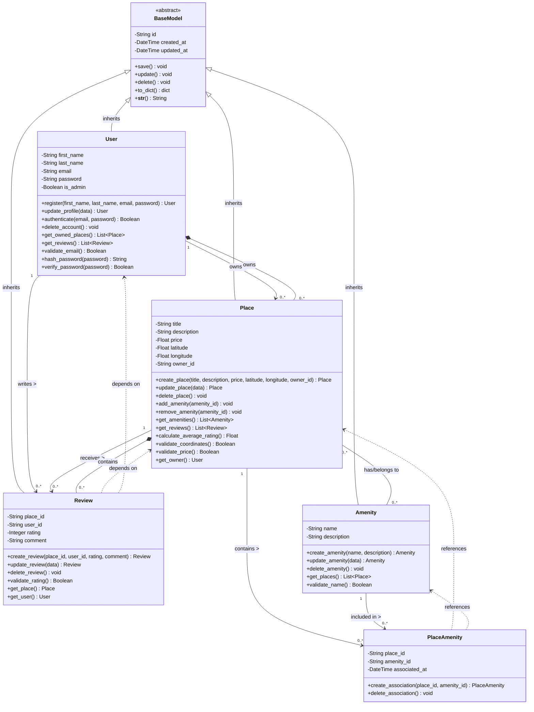

# Detailed Class Diagram for Business Logic Layer

## HBnB Evolution - Business Logic Layer Class Diagram

---

## Detailed Explanatory Notes

### 1. BaseModel (Abstract Class)

**Role in System:**  
BaseModel serves as the foundational abstract class for all entities in the Business Logic Layer. It implements the DRY (Don't Repeat Yourself) principle by providing common attributes and methods that all entities share.

**Key Attributes:**
- `id (String)`: Universally Unique Identifier (UUID4) for each object instance
- `created_at (DateTime)`: Timestamp of object creation for audit trail
- `updated_at (DateTime)`: Timestamp of last modification for audit trail

**Key Methods:**
- `save()`: Persists the object to the database
- `update()`: Updates the object's modified timestamp and persists changes
- `delete()`: Removes the object from the database
- `to_dict()`: Serializes object to dictionary format for API responses
- `__str__()`: Returns string representation of the object

**Design Rationale:**  
Using an abstract base class ensures consistency across all entities and simplifies maintenance by centralizing common functionality.

---

### 2. User Entity

**Role in System:**  
Manages all user-related operations including registration, authentication, profile management, and permission control. Users can be regular users or administrators.

**Key Attributes:**
- `first_name (String)`: User's first name
- `last_name (String)`: User's last name
- `email (String)`: Unique email address for authentication
- `password (String)`: Hashed password for security
- `is_admin (Boolean)`: Flag to distinguish administrators from regular users

**Key Methods:**
- `register()`: Creates a new user account with validation
- `update_profile()`: Modifies user information
- `authenticate()`: Verifies user credentials during login
- `delete_account()`: Removes user and associated data
- `get_owned_places()`: Retrieves all places owned by the user
- `get_reviews()`: Retrieves all reviews written by the user
- `validate_email()`: Ensures email format is valid
- `hash_password()`: Securely hashes passwords before storage
- `verify_password()`: Compares provided password with stored hash

**Business Rules:**
- Email must be unique across all users
- Passwords must be hashed (never stored in plain text)
- Administrators have elevated permissions for system management
- Users can own multiple places and write multiple reviews

---

### 3. Place Entity

**Role in System:**  
Represents properties (places) available for rental. Manages property details, location, pricing, amenities, and relationships with owners and reviews.

**Key Attributes:**
- `title (String)`: Property name/title
- `description (String)`: Detailed description of the property
- `price (Float)`: Rental price per night/period
- `latitude (Float)`: Geographic latitude coordinate
- `longitude (Float)`: Geographic longitude coordinate
- `owner_id (String)`: Foreign key reference to User entity

**Key Methods:**
- `create_place()`: Creates a new property listing
- `update_place()`: Modifies property information
- `delete_place()`: Removes property from system
- `add_amenity()`: Associates an amenity with the place
- `remove_amenity()`: Removes an amenity association
- `get_amenities()`: Retrieves all amenities for the place
- `get_reviews()`: Retrieves all reviews for the place
- `calculate_average_rating()`: Computes average rating from all reviews
- `validate_coordinates()`: Ensures latitude/longitude are valid
- `validate_price()`: Ensures price is positive and reasonable
- `get_owner()`: Retrieves the User who owns this place

**Business Rules:**
- Each place must have exactly one owner (User)
- Price must be a positive number
- Coordinates must be valid geographical coordinates
- Places can have multiple amenities and reviews
- Average rating is calculated from all associated reviews

---

### 4. Review Entity

**Role in System:**  
Manages user feedback and ratings for places. Enables users to share their experiences and helps other users make informed decisions.

**Key Attributes:**
- `place_id (String)`: Foreign key reference to Place entity
- `user_id (String)`: Foreign key reference to User entity
- `rating (Integer)`: Numerical rating (1-5 scale)
- `comment (String)`: Textual feedback/review

**Key Methods:**
- `create_review()`: Creates a new review for a place
- `update_review()`: Modifies existing review
- `delete_review()`: Removes review from system
- `validate_rating()`: Ensures rating is within valid range (1-5)
- `get_place()`: Retrieves the Place being reviewed
- `get_user()`: Retrieves the User who wrote the review

**Business Rules:**
- Each review is associated with exactly one place and one user
- Rating must be an integer between 1 and 5 (inclusive)
- Users can only review places they have visited
- Reviews contribute to the place's average rating

---

### 5. Amenity Entity

**Role in System:**  
Represents features and facilities available at properties (e.g., WiFi, Pool, Parking, Air Conditioning). Amenities can be shared across multiple places.

**Key Attributes:**
- `name (String)`: Amenity name (e.g., "WiFi", "Swimming Pool")
- `description (String)`: Detailed description of the amenity

**Key Methods:**
- `create_amenity()`: Creates a new amenity
- `update_amenity()`: Modifies amenity information
- `delete_amenity()`: Removes amenity from system
- `get_places()`: Retrieves all places that have this amenity
- `validate_name()`: Ensures amenity name is unique

**Business Rules:**
- Amenity names should be unique
- Amenities can be associated with multiple places
- Removing an amenity doesn't delete the places that had it

---

### 6. PlaceAmenity (Association Class)

**Role in System:**  
Manages the many-to-many relationship between Places and Amenities. This association class allows tracking of when amenities were added to places.

**Key Attributes:**
- `place_id (String)`: Foreign key to Place
- `amenity_id (String)`: Foreign key to Amenity
- `associated_at (DateTime)`: Timestamp when amenity was added

**Key Methods:**
- `create_association()`: Links a place with an amenity
- `delete_association()`: Removes the link between place and amenity

**Design Rationale:**  
Using an association class provides flexibility for future enhancements (e.g., tracking who added the amenity, additional metadata).

---

## Relationships Explanation

### Inheritance Relationships
All main entities (User, Place, Review, Amenity) inherit from BaseModel, ensuring:
- Consistent ID generation (UUID4)
- Automatic timestamp management (created_at, updated_at)
- Shared CRUD operations
- Uniform serialization methods

### Association Relationships

1. **User → Place (1:N)**
   - One user can own multiple places
   - Each place has exactly one owner
   - Type: Composition (strong ownership - if user is deleted, their places should be handled appropriately)

2. **User → Review (1:N)**
   - One user can write multiple reviews
   - Each review is written by exactly one user

3. **Place → Review (1:N)**
   - One place can receive multiple reviews
   - Each review is about exactly one place
   - Type: Composition (reviews are dependent on the place existing)

4. **Place ↔ Amenity (M:N)**
   - One place can have multiple amenities
   - One amenity can be associated with multiple places
   - Implemented through PlaceAmenity association class

### Multiplicity Notation
- `1`: Exactly one
- `0..*`: Zero or more
- `1..*`: One or more

---

## SOLID Principles Applied

### 1. Single Responsibility Principle (SRP)
Each class has one clear responsibility:
- User: Manages user accounts and authentication
- Place: Manages property listings
- Review: Manages user feedback
- Amenity: Manages property features

### 2. Open/Closed Principle (OCP)
Classes are open for extension (through inheritance from BaseModel) but closed for modification.

### 3. Liskov Substitution Principle (LSP)
All entities can be treated as BaseModel instances where appropriate.

### 4. Interface Segregation Principle (ISP)
Each class exposes only the methods relevant to its functionality.

### 5. Dependency Inversion Principle (DIP)
High-level modules (entities) depend on abstractions (BaseModel) rather than concrete implementations.

---

## Design Patterns Used

1. **Template Method Pattern**: BaseModel provides template methods (save, update, delete) that can be customized by subclasses

2. **Factory Pattern**: Create methods (register, create_place, create_review, create_amenity) act as factory methods

3. **Facade Pattern**: Each entity's methods provide a simplified interface to complex operations

---

## Validation and Business Logic

### User Validation
- Email format validation
- Password strength requirements
- Unique email constraint

### Place Validation
- Price must be positive
- Coordinates must be valid geographical values (-90 to 90 for latitude, -180 to 180 for longitude)
- Title and description cannot be empty

### Review Validation
- Rating must be between 1 and 5
- User must exist
- Place must exist
- Comment is optional but recommended

### Amenity Validation
- Name must be unique
- Description should be descriptive

---

## Audit Trail Implementation

All entities inherit audit trail capabilities from BaseModel:
- `created_at`: Automatically set when object is created
- `updated_at`: Automatically updated whenever object is modified
- `id`: UUID4 ensures global uniqueness

This satisfies the requirement: *"For audit reasons, the creation and update datetime should be registered for all entities."*

---

## Future Extensibility

The design allows for easy extension:
1. Adding new entity types by inheriting from BaseModel
2. Adding new amenity types without code changes
3. Extending user roles beyond admin/regular user
4. Adding new review types or rating systems
5. Supporting different pricing models

---

## API Integration Points

Each entity provides methods that map directly to API endpoints:
- **User**: POST /register, PUT /users/{id}, DELETE /users/{id}
- **Place**: POST /places, PUT /places/{id}, DELETE /places/{id}, GET /places
- **Review**: POST /reviews, PUT /reviews/{id}, DELETE /reviews/{id}, GET /places/{id}/reviews
- **Amenity**: POST /amenities, PUT /amenities/{id}, DELETE /amenities/{id}, GET /amenities

---

## Database Persistence Considerations

While the specific database implementation will be handled in Part 3, the design considers:
- UUID4 for IDs enables distributed systems
- DateTime fields support audit trails
- Foreign key relationships are clearly defined
- Many-to-many relationships use association tables
- All relationships support efficient querying

---

## Conclusion

This detailed class diagram provides a comprehensive blueprint for the Business Logic Layer of the HBnB Evolution application. It adheres to:
- All specified business requirements
- UML notation standards
- SOLID principles
- Best practices in object-oriented design
- Audit trail requirements
- Extensibility and maintainability goals

The diagram is ready to guide the implementation phase and ensures a robust, scalable, and maintainable codebase .
